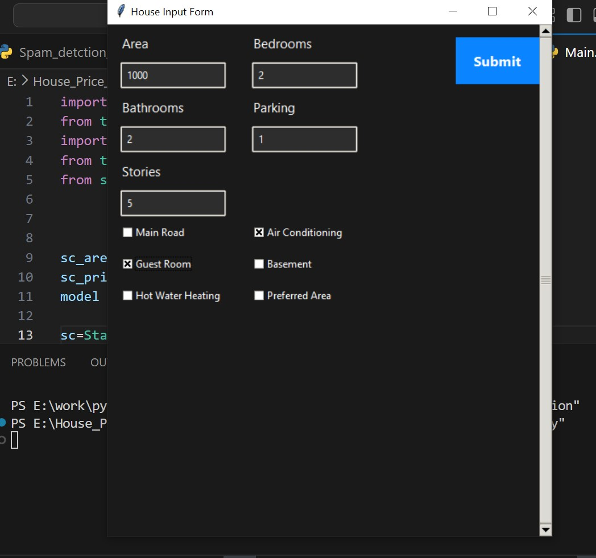
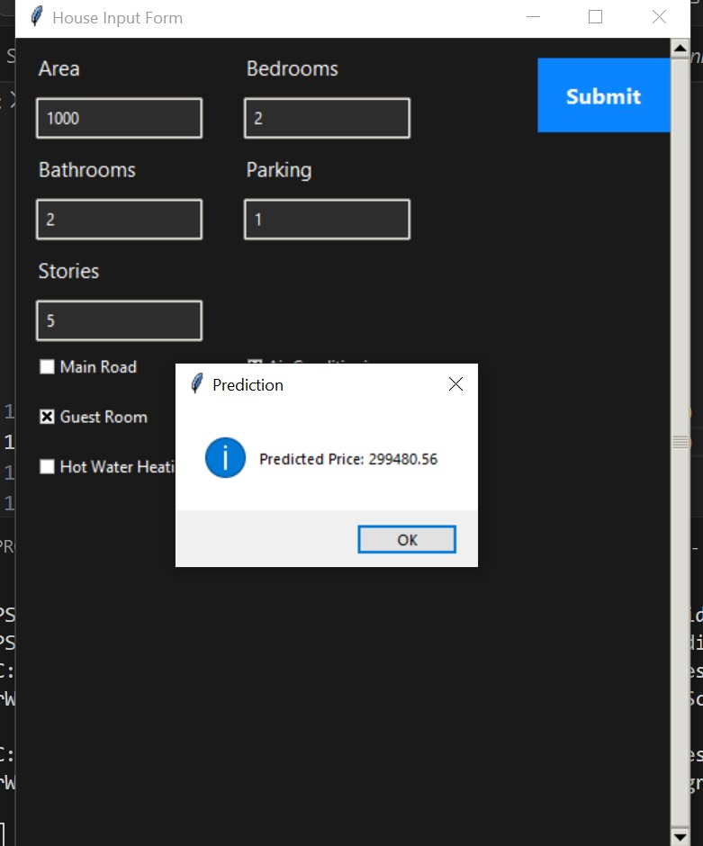
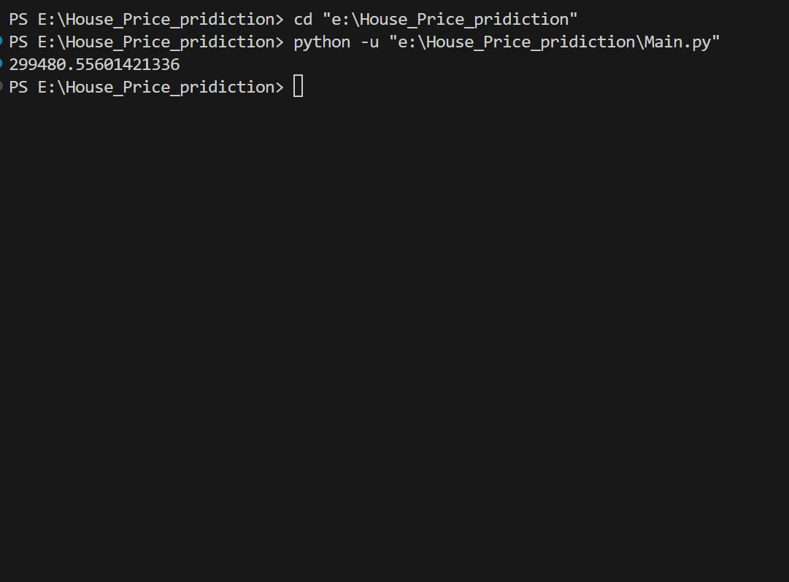

# 🏡 House Price Prediction using Machine Learning (Tkinter GUI)

This project predicts **house prices** using a **Linear Regression model** built with Python’s Machine Learning libraries.
Users enter property details through a **Tkinter desktop application**, and the model instantly displays the predicted price.

---

## 📌 Features

* ✔ Predicts house price based on **13 property features**
* ✔ Built using **Linear Regression (Scikit-Learn)**
* ✔ Clean ML pipeline using Pandas & NumPy
* ✔ Data visualization using Matplotlib & Seaborn
* ✔ Tkinter GUI for user interaction
* ✔ Handles warnings for a smooth runtime experience

---

## 🧩 Input Features (User Provided)

The system predicts price based on the following fields:

| Feature              | Description                              |
| -------------------- | ---------------------------------------- |
| **price**            | Target variable (used for training only) |
| **area**             | Total area (sq ft)                       |
| **bedrooms**         | Number of bedrooms                       |
| **bathrooms**        | Number of bathrooms                      |
| **stories**          | Number of stories                        |
| **mainroad**         | Yes / No                                 |
| **guestroom**        | Yes / No                                 |
| **basement**         | Yes / No                                 |
| **hotwaterheating**  | Yes / No                                 |
| **airconditioning**  | Yes / No                                 |
| **parking**          | Parking spaces                           |
| **prefarea**         | Preferred area (Yes/No)                  |
| **furnishingstatus** | Furnished / Semi-Furnished / Unfurnished |

These features are processed and passed to the linear regression model.

---

## 🧠 Technologies Used

| Purpose           | Library                     |
| ----------------- | --------------------------- |
| Data Processing   | **Pandas**, **NumPy**       |
| Machine Learning  | **Scikit-Learn**            |
| Plotting & EDA    | **Matplotlib**, **Seaborn** |
| GUI               | **Tkinter**                 |
| Warning Filtering | **warnings**                |

---

## 🔧 How the Model Works

1. Load & clean dataset
2. Handle categorical values (label encoding / mapping)
3. Split into training & testing sets
4. Train a **Linear Regression model**
5. Save the model (optional using pickle)
6. Tkinter GUI collects user inputs
7. Inputs are processed and the model predicts the price

Example model training snippet:

```python
from sklearn.linear_model import LinearRegression
model = LinearRegression()
model.fit(X_train, y_train)
```

---

## 🖥️ Tkinter GUI

The GUI form includes fields for all house attributes.
After entering the data, the user clicks **Predict**, and the estimated house price is shown in the window.

Example GUI workflow:

* Enter area, bedrooms, bathrooms…
* Choose Yes/No fields from dropdowns
* Click **Predict Price**
* The predicted price appears instantly
---

🖥️ Screenshots (GUI Output)
⭐ 1. User Interface (Home Screen)
<hr>
<div align="center">  </div>
<hr>
⭐ 2. Price Prediction Output
<hr>
<div align="center">  </div>
<hr>
⭐ 3. Price In Terminal Output
<hr>
<div align="center">  </div>
<hr>


## ▶️ How to Run

### 1. Install required libraries

```
pip install pandas numpy scikit-learn matplotlib seaborn
```

### 2. Run the training script

```
python train_model.py
```

### 3. Start the Tkinter application

```
python main.py
```

---

## 📊 Optional Visualizations

The project can display:

* Price distribution
* Correlation heatmap
* Feature vs price plots

Example:

```python
import seaborn as sns
sns.heatmap(df.corr(), annot=True)
```

---


